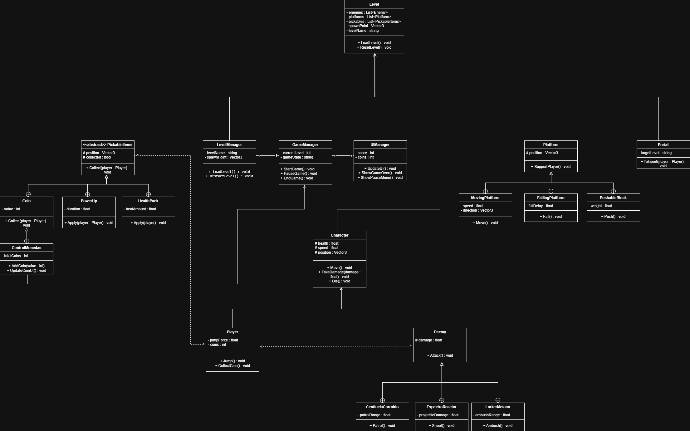

# Nebula
Proyecto académico desarrollado para la materia **Scripting – Ingeniería en Diseño de Entretenimiento Digital (UPB)**.

Nebula es un videojuego de plataformas 2D desarrollado en **Unity** utilizando el framework **Corgi Engine**.

El jugador controla a **Darius Holt**, un recolector enviado a explorar una estación minera abandonada en **Titán**, luna de Saturno. Durante la exploración descubrirá anomalías energéticas, enemigos hostiles y restos de una operación minera fallida.

---

# Tecnologías Utilizadas

- Unity Engine 2022.3 LTS
- C#
- Corgi Engine Framework
- Git / GitHub
- Visual Studio / Visual Studio Code

---

# Integrantes del Proyecto

- Stella Perez
- Juan Camilo Tique

---
## UML Class Diagram



---

# Entrega 2 – Desarrollo del Proyecto

Para esta entrega se implementaron nuevas funcionalidades y mejoras visuales dentro del juego.

## Diseño del Nivel 2

Se realizó el diseño manual del segundo nivel teniendo en cuenta:

- progresión de dificultad
- distribución de plataformas
- posicionamiento de enemigos
- ubicación estratégica de monedas

Posteriormente el nivel fue implementado en Unity utilizando **Tilemaps y plataformas del Corgi Engine**.

---

## Personalización Gráfica

Se diseñaron nuevos elementos visuales para el nivel 2:

### Fondo

El fondo representa una zona interna deteriorada de la estación minera, que corresponde en su mayoría a la oscuridad de la cueva.

---

### Plataformas

Las plataformas fueron diseñadas con una estética industrial para mantener coherencia con el entorno:

---

## Sistema de Monedas

Se diseñaron monedas recolectables que representan **fragmentos de energía cristalizada provenientes de los reactores de la estación minera**.

---

## Sistema de Portales

Se implementaron **portales de transición de nivel** que permiten al jugador avanzar dentro de la estación minera.

Los portales funcionan como puntos de conexión entre áreas del juego.

---

## Pantalla Game Over

Se implementó una pantalla de **Game Over** que se activa cuando el jugador pierde todas sus vidas.

Opciones disponibles:

- reiniciar el nivel
- volver al menú principal

---

## Diagramas del Sistema

Se realizaron diagramas de clases para representar la estructura del sistema del juego.


---

# Instalación y Configuración

Este proyecto está desarrollado con **Unity** y utiliza el framework **Corgi Engine**.

## Prerrequisitos

- Unity Hub  
- Unity **2022.3 LTS**
- Git
- Visual Studio Community o Visual Studio Code

---

## Clonar el Repositorio

```bash
cd tu-carpeta-de-proyectos
git clone https://github.com/xaca/scripting2026.git
cd scripting2026

```
---

## Recursos Adicionales / Additional Resources
Unity Documentation
Corgi Engine Documentation
Git Tutorial
